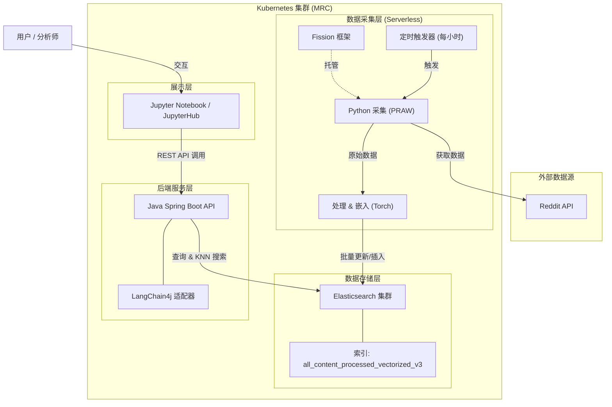

# 澳大利亚归属感分析系统 - 第7组

## 团队成员

*   **Zifei Li** (1638553)
*   **Yunpeng Xiong** (1513076)
*   **Tianyun Lei** (1454701)
*   **Yongchun Li** (1378156)
*   **Haowen Zhang** (1635503)

## 项目概览

本项目是一个可扩展的大数据分析系统，旨在探索澳大利亚人“归属感”的多维表达。通过利用云技术和自然语言处理（NLP），我们分析了与**住房**、**薪资**、**心理健康**和**移民**等关键社会经济因素相关的社交媒体讨论（特别是来自 Reddit 的数据）。

该系统提供了一种数据驱动的方法，以了解这些因素如何促进或削弱澳大利亚不同地理区域的归属感。

## 系统架构

该系统基于微服务架构构建，使用 **Kubernetes** 部署在 **墨尔本研究云 (MRC)** 上。它利用无服务器计算进行数据采集，并使用强大的搜索引擎进行数据存储和检索。

### 核心组件

*   **基础设施**：托管在墨尔本研究云上，由 **Kubernetes** 编排。
*   **数据采集 (Fission)**：运行在 **Fission** 上的无服务器 Python 函数。它定期（每小时）使用 **PRAW** 从 Reddit 获取数据，执行情感分析，使用 **Torch** 生成文本嵌入，并将数据摄入 Elasticsearch。使用自定义 Docker 镜像来支持 Fission 环境中的 PyTorch 等依赖项。
*   **存储 (Elasticsearch)**：分布式 **Elasticsearch** 集群（通过 ECK 部署）存储处理后的数据。它支持标准布尔查询和基于向量的 KNN 搜索，以实现语义相似性检索。
*   **后端 API (Spring Boot)**：一个 **Java Spring Boot** 应用程序，公开 RESTful 端点。它充当数据的网关，处理来自前端的查询并与 Elasticsearch 交互。
*   **前端 (Jupyter Notebook)**：一个交互式分析环境，用户可以在其中可视化数据、查看情感地图，并使用 Python 库分析趋势，通过后端 API 消费数据。

## 仓库结构

*   **`backend/`**：核心后端逻辑和配置。
    *   `T7BE/`：Java Spring Boot 后端 API 源代码。
    *   `harvesters/`：用于数据收集、处理和 Fission 函数定义的 Python 脚本。
    *   `fission-custom-images/`：自定义 Fission 环境（支持 PyTorch 等）的 Dockerfile 和构建脚本。
    *   `ElasticSearch Upgrade/`：用于在 Kubernetes (ECK) 上部署和升级 Elasticsearch 的配置文件 (YAML)。
*   **`database/`**：数据存储的文档和配置。
    *   `Index_Mapping.json`：Elasticsearch 索引模式定义。
    *   `DSL_Queries.md`：Elasticsearch 查询示例。
*   **`docs/`**：项目文档和报告。
*   **`test/`**：系统的集成和单元测试。
*   **`Assignment2.md`**：作业具体详情。

## 功能特性

1.  **定向数据收集**：根据特定关键词（住房、薪资、心理健康、移民）和地理位置（使用官方澳大利亚地区数据）过滤 Reddit 帖子和评论。
2.  **高级 NLP 管道**：
    *   **情感分析**：使用 VADER 和 TextBlob 计算情感得分。
    *   **文本嵌入**：生成向量嵌入以实现语义搜索功能。
3.  **无服务器架构**：利用 Fission 实现经济高效的事件驱动型数据摄入。
4.  **语义搜索**：不仅可以通过关键词，还可以通过含义查找相关讨论，使用 Elasticsearch 的向量搜索。
5.  **地理空间分析**：将情感和讨论量映射到特定的澳大利亚地区 (`loc_pid`)。

## 技术深度解析

本项目不仅仅是一个简单的数据展示应用，更是一次对现代云原生数据工程的完整实践。

### 1. 数据治理与质量控制
面对社交媒体数据的非结构化和高噪声特性，我们实施了严格的数据治理策略：
*   **异构数据清洗与消歧**：针对 Reddit 的自由文本数据，我们开发了 `locality_resolver` 模块。通过加载官方地理数据集，解决了澳大利亚地名中常见的“同名异地”问题（例如，多个州都有 "Richmond"）。系统能够根据上下文或用户元数据精确映射到唯一的 `loc_pid`，确保地理空间分析的准确性。
*   **源头降噪策略**：摒弃了低效的全量爬取方案，我们采用了基于特定领域关键词（如 "Housing Crisis", "Immigration"）的**定向搜索策略**。利用 PRAW 的 `subreddit.search` 接口，在数据采集的最前端即过滤掉 90% 以上的无关噪声，显著提升了处理效率和存储信噪比。
*   **幂等性与一致性**：为应对分布式采集可能带来的重复数据问题，我们设计了基于 Reddit 原始内容 ID 的 `unique_id` 生成机制。结合 Elasticsearch 的 `upsert`（更新插入）操作，确保了数据写入的幂等性，即使在网络波动导致重试的情况下，也能保证数据的最终一致性。

### 2. Elasticsearch 索引与查询工程
为了支撑毫秒级的复杂查询响应，我们在 Elasticsearch 的设计上下足了功夫：
*   **混合索引设计**：`all_content_processed_vectorized_v3` 索引采用了精细的 Mapping 设计。
    *   **全文检索**：`text` 字段配合标准分词器，支持对用户评论的模糊匹配。
    *   **精确分析**：`keyword` 字段（如 `state`, `basic_emotion`, `loc_pid`）用于高效的聚合（Aggregation）和过滤（Filter），支持多维度的下钻分析。
    *   **向量空间**：引入 `dense_vector` 字段存储由 PyTorch 模型生成的 768 维文本嵌入，支持余弦相似度（Cosine Similarity）计算。
*   **动态 DSL 构建**：后端服务封装了强大的 DSL（Domain Specific Language）构建器。它不再依赖硬编码的查询字符串，而是根据前端请求动态组装 `bool` 复合查询。通过灵活组合 `must`（评分匹配）、`filter`（缓存过滤）和 `should`（加权召回）子句，实现了对时间、地点、情感和话题的任意组合查询。
*   **语义搜索实现**：利用 ES 的 KNN（K-Nearest Neighbors）搜索能力，系统能够捕捉用户的“搜索意图”。即使用户输入的关键词在文本中未显式出现，只要语义相近（向量距离近），相关内容依然能被精准召回。

### 3. Kubernetes 云原生架构实践
系统完全拥抱云原生理念，充分利用了 K8s 的编排能力：
*   **ECK Operator 管理**：我们摒弃了传统的 StatefulSet 手动部署方式，转而采用 **Elastic Cloud on Kubernetes (ECK) Operator**。这使得 ES 集群的节点发现、TLS 证书自动轮转、扩缩容以及版本滚动更新变得自动化和标准化，极大地降低了运维复杂度。
*   **Serverless 混合编排**：利用 **Fission** 框架，我们将 Python 数据采集脚本容器化为无服务器函数（Function）。通过配置 K8s 原生的 `TimeTrigger`（CRD），实现了 CronJob 级别的定时任务调度。这种设计使得采集资源“用完即走”，相比常驻 Pod 节省了大量计算资源。
*   **持久化与高可用**：在存储层，我们定义了 `volumeClaimTemplates` 并绑定高性能存储类 (`storageClassName: perfretain`)。这确保了即使在 Pod 发生漂移或重启时，Elasticsearch 的分片数据依然能够持久化保存，保障了业务的高可用性。

### 4. AI 驱动的洞察生成 (RAG & LangChain4j)
为了从海量文本中提取深层价值，我们构建了一个基于 **LangChain4j** 的 RAG（检索增强生成）管道，实现了从“搜索”到“洞察”的跨越：
*   **模型无关性设计 (Model Agnostic)**：后端架构解耦了具体的 LLM 实现，通过配置文件即可无缝切换 **Google Gemini**、**Mistral AI**、**Qwen (通义千问)** 或 **OpenAI** 等多种大模型。这种设计不仅避免了供应商锁定，还能根据成本和性能需求灵活选择推理引擎。
*   **结构化输出工程**：利用 LangChain4j 的注解系统和 Prompt Engineering，我们强制 LLM 输出严格符合 Schema 定义的 JSON 数据。这解决了大模型输出不稳定的痛点，使得前端可以直接消费 AI 生成的分析结果，无需复杂的后处理。
*   **混合检索增强**：系统首先通过 Elasticsearch 的向量搜索召回最相关的社区讨论，然后将其作为上下文（Context）注入到 LLM 的 Prompt 中。这种“向量召回 + LLM 归纳”的模式，既利用了本地数据的时效性和准确性，又发挥了大模型的归纳推理能力。

### 5. 自定义 Serverless 运行时工程
在 Fission 平台上运行深度学习任务面临着巨大的挑战，我们通过自定义运行时环境攻克了这一难题：
*   **突破 Alpine 限制**：标准的 Fission Python 环境基于轻量级的 Alpine Linux，其 `musl libc` 库无法原生支持 **PyTorch** 等依赖 `glibc` 的重量级 AI 框架。我们构建了基于 Debian 的自定义 Docker 镜像，成功在 Serverless 环境中运行了完整的 PyTorch 及其依赖。
*   **依赖隔离与优化**：我们将 `torch`、`nltk`、`scikit-learn` 等大型库预打包进基础镜像 (`backend/fission-custom-images/`)，避免了函数冷启动时的动态安装耗时。这使得我们的采集函数虽然包含复杂的 NLP 计算（情感分析、向量嵌入），但仍能保持秒级的启动速度和高效的执行性能。

## 部署与设置

### 前置条件
*   Kubernetes 集群 (v1.24+)
*   已配置 kubectl
*   Java 17+ & Maven (用于后端)
*   Python 3.9+ (用于采集器开发/测试)

### 步骤

1.  **基础设施设置**：
    *   配置 Kubernetes 集群。
    *   在集群上安装 **Fission**。
    *   部署 **Elasticsearch**（推荐使用 ECK operator）。参考 `backend/ElasticSearch Upgrade/README.md`。

2.  **数据管道 (Fission)**：
    *   从 `backend/fission-custom-images/` 构建自定义 Fission 环境镜像。
    *   部署位于 `backend/harvesters/fission/` 的采集函数。
    *   配置定时触发器以定期运行采集器。

3.  **后端服务**：
    *   导航到 `backend/T7BE/`。
    *   在 `application.properties` 中更新您的 Elasticsearch 凭据。
    *   使用 `deploy.sh` 或 `k8s-deployment.yaml` 构建并将 Spring Boot 应用程序部署到 Kubernetes。

4.  **前端分析**：
    *   启动 Jupyter Notebook 实例（本地或通过 JupyterHub）。
    *   使用提供的笔记本（或创建新笔记本）连接到后端 API 端点。

## 许可证

本项目是为 COMP90024 Cluster and Cloud Computing 创建的。
